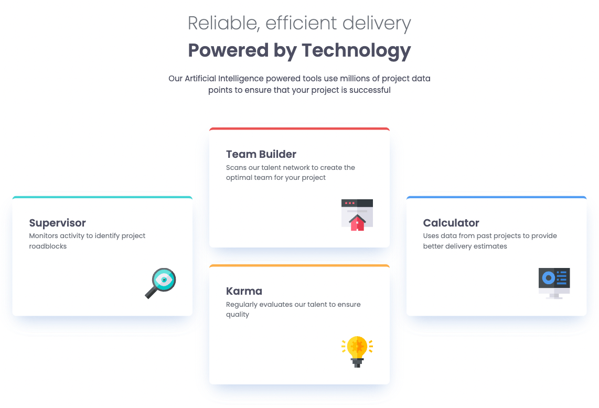

# four-card-section
This is my solution to the **Four Card Feature Section** from Frontend Mentor.

## Live Demo
[View Live](https://anjelotin.github.io/four-card-section/)

## Technologies Used
- HTML
- CSS (Grid, Media Query, Custom Properties, Animations)
- Mobile-first workflow
- Google Fonts

## Screenshot

## What I learned

During this project I focused on:

- **Responsive Layouts:** I used a mobile first approach. I ensured the design worked well on mobile, tablet, and desktop devices. 
- **Grid and Flexbox for Layout:** I utilized CSS Grid for overall structure for the four cards and Flexbox for aligning elements within each card. 
- **CSS Organization:** I used custom properties from colors and fonts.

## Continued Improvements
A few things I would like to continue working on are:

- Making font sizes more fluid with the `clamp()` function.
- Get more familar with Grid.
- Explore animations.